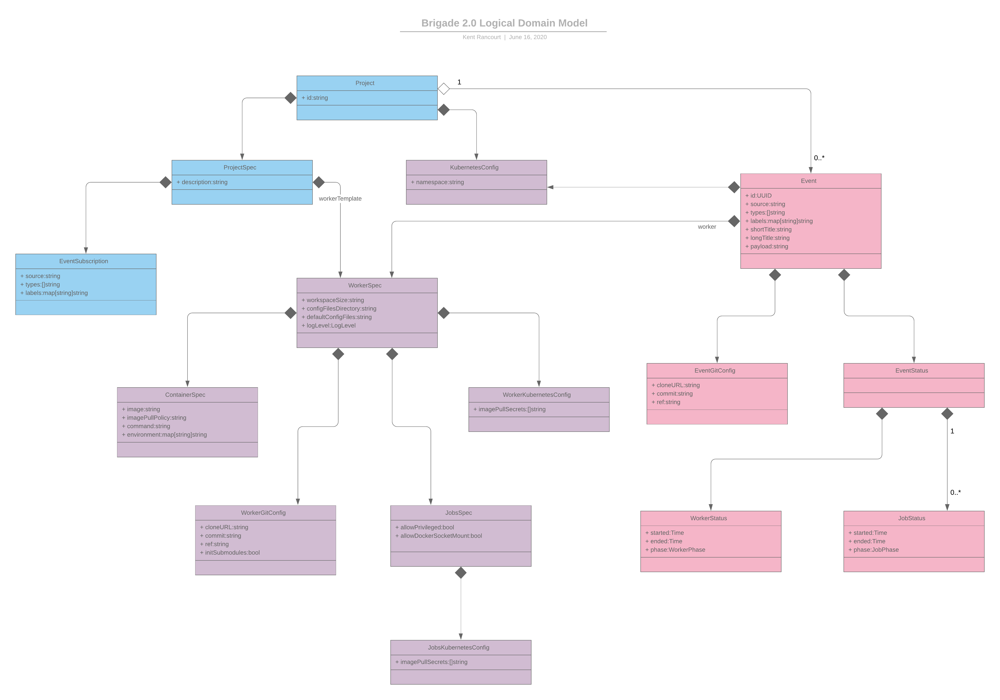
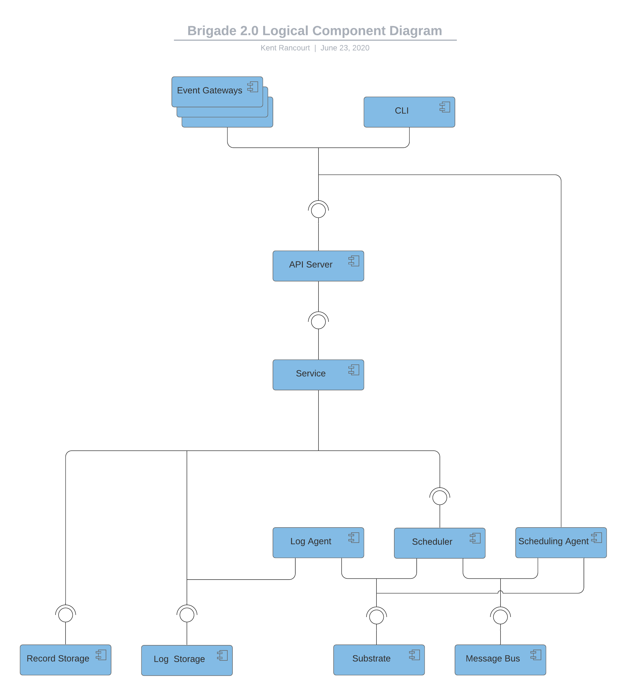
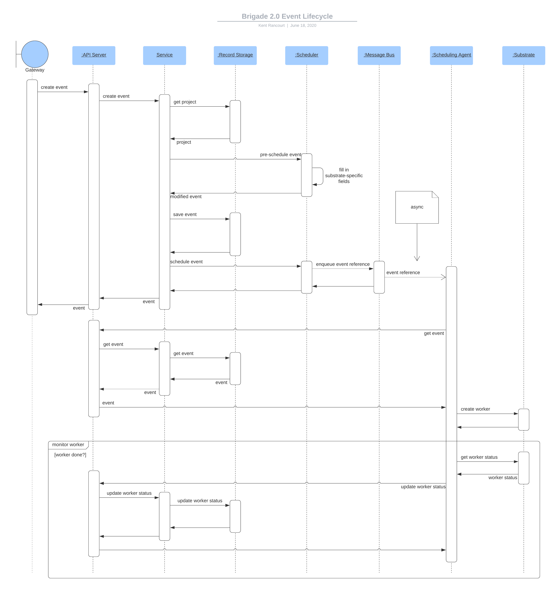
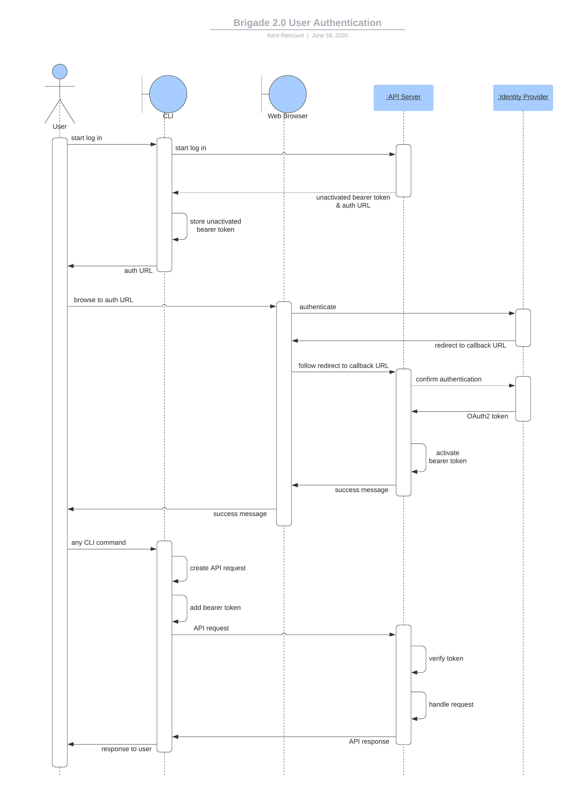

# Brigade 2.0 Proposal

Since its first major release, Brigade has proven itself a useful and
[moderately
popular](https://www.cncf.io/wp-content/uploads/2020/03/CNCF_Survey_Report.pdf)
platform for achieving _"event-driven scripting for Kubernetes."_ Over that same
period, reports from our community and the maintainers' own efforts to "dog
food" Brigade have exposed many issues and reasonable feature requests which can
be addressed only by re-architecting the product and incurring some degree of
breaking changes. _In other words, it is time to talk about Brigade 2.0._

In this document, one project maintainer, operating with input from other
maintainers, wishes to present a formal proposal for Brigade 2.0, and solicit
feedback from and ratification by the broader Brigade community.

## TL;DR

Brigade 2.0 is proposed to introduce a less Kubernetes-centric experience,
wherein users having little or no Kubernetes experience, or even those lacking
direct access to a cluster, can quickly become productive. Breaking changes are
on the docket, but Brigade 2.0 should feel familiar to anyone with previous
Brigade experience. In short, the author proposes Brigade's nuanced transition
from "event-driven scripting for Kubernetes" to "event driven scripting (for
Kubernetes)."

## Contents

* [Motivations](#motivations)
  * [Early Design Decisions & Architecture](#early-design-decisions-%25-architecture)
  * [Usability](#usability)
  * [Security](#security)
  * [Data Loss](#data-loss)
  * [Resource Contention](#resource-contention)
  * [Event Subscriptions](#event-subscriptions)
  * [Alternative Workers](#alternative-workers)
  * [The GitHub Tangle](#the-github-tangle)
  * [Job Sidecars](#job-sidecars)
  * [Retriable Workflows](#retriable-workflows)
  * [Philosophical Pivots](#philosophical-pivots)
* [Proposed Path Forward](#proposed-path-forward)
  * [Guiding Principles](#guiding-principles)
  * [Domain Model](#domain-model)
  * [High Level Architecture](#high-level-architecture)
  * [API Endpoints](#api-endpoints)
  * [Service Layer](#service-layer)
  * [Record Storage](#record-storage)
  * [Scheduling](#scheduling)
  * [Logging](#logging)
  * [Securing Brigade](#securing-brigade)
    * [Authentication](#authentication)
    * [Authorization](#authorization)
    * [Secret Storage](#secret-storage)
    * [Preventing Escalation of Privileges](#preventing-escalation-of-privileges)
  * [Summary of Proposed Changes](#summary-of-proposed-changes)
  * [Assumptions](#assumptions)
  * [Unknowns](#unknowns)
  * [Proof of Concept](#proof-of-concept)
  * [Development Approach](#development-approach)
  * [Roadmap](#roadmap)
  * [Ratifying this Proposal](#ratifying-this-proposal)

## Motivations

To understand both the philosophical and technical drivers of the proposed
changes, a brief examination of Brigade's early design decisions, its
architecture, and a selection of existing issues is in order.

### Early Design Decisions & Architecture

Brigade was designed to be as lightweight and "cloud native" as possible,
shunning third-party dependencies and relying solely on Kubernetes wherever
practical. To be sure, this approach had its merits. By leveraging Kubernetes
`Secret` resources as a sort of makeshift document store and message bus,
Brigade's developers were spared from integrating with third-party alternatives.
Meanwhile, Brigade operators were spared from deploying and managing such
dependencies.

These principles resulted in a _very thin_ layer of abstraction between
Brigade's users and Kubernetes. The `brig` CLI, for instance, communicates
_directly_ with the Kubernetes API server using the user's own cluster
credentials. Similarly, gateways that broker events from external systems like
GitHub, Docker Hub, or Slack (to name a few), communicate directly with the
Kubernetes API server using Kubernetes service accounts.

Brigade owes much of its early success to its lightweight nature, but many
outstanding issues can also be traced back to these early design decisions,
which this proposal suggests are worth revisiting.

### Usability

Usability issues have been a common complaint. By way of example, anyone who has
created a Brigade project through the interactive `brig project create` command
is likely to have found that experience clumsy. In the event of later wishing to
revise one's project definition, users discover that the CLI exposes no `project
update` command. A novice user might issue a `brig project create --replace`
command to repeat the onerous creation process in its entirety. Meanwhile, an
intrepid Kubernetes user might directly edit the `Secret` resource backing the
project definition. Maintainers are aware of many such users having fallen back
on Helm or loose Kubernetes manifests to manage their Brigade projects.

To be fair, this particular issue is a UX one and could probably be remediated
without re-architecting the entire product, but it is noteworthy because it
illustrates just how thin Brigade's abstraction between the user and Kubernetes
is. While a seasoned Kubernaut might perceive the ability to "drop down" to
Kubernetes on an as-needed basis to be a feature, a novice user is more likely
to perceive that UX in more perilous terms, such as falling through thin ice.

In the view of the author, permitting Kubernetes expertise to remain a _de
facto_ prerequisite for success creates a barrier to adoption by a broader
population of developers who may lack such expertise but could otherwise find
value in Brigade.

Refer to:

* [Issue #1044](https://github.com/brigadecore/brigade/issues/1044)

### Security

Brigade's abstraction between users and Kubernetes being as thin as it is poses
an inherent security risk. Because the `brig` CLI is useless without Kubernetes
cluster credentials, all Brigade users must have such credentials and,
minimally, be granted read access to `Secret` resources within Brigade's
namespace. If Brigade hosts any projects other than the users' own, that user
can too easily access those projects' secrets and the risk that presents cannot
be overstated.

N.B.: The current workaround for this is to run a separate Brigade instance for
each project or logical group of projects, which has the potential to become a
resource drain as the number of projects increases.

N.B.: Isolating each Brigade project to its own namespace has been among
Brigade's most requested features.

Since the author additionally wishes for Kubernetes expertise not to remain a
_de facto_ prerequisite, it is also worth weighing the risks posed by granting
_any_ level of cluster access to a novice user.

These factors strongly point to the need for better isolation between projects,
and an access control model that is viable for users who are not granted direct
access to the cluster.

Refer to:

* [Issue #755](https://github.com/brigadecore/brigade/issues/755)

### Data Loss

Reiterating that Brigade leverages Kubernetes as a makeshift data store, it is
worth examining whether it fills that role well or whether possible alternatives
are due some consideration.

On the surface, persisting Brigade projects as `Secret` resources may seem
sensible. Yet, projects are not the only Brigade objects that are backed by
Kubernetes resources. _Workers_ that process Brigade events, for instance, are
backed by the Kubernetes pods in which they were executed. A worker's logs are
found nowhere except within the corresponding pod. CLI commands such as `brig
build logs` only retrieve those logs via the Kubernetes API. Even a worker's
state is determined solely by the corresponding pod's state, and a worker's very
existence is coupled to the existence of the corresponding pod. Should a pod be
deleted, all record of the corresponding worker is deleted with it.

While Kubernetes users who like a tidy cluster may be put off by completed pods
hanging around indefinitely for the sake of data retention, the above is even
more problematic when considering the array of circumstances beyond any user's
control under which a pod might be deleted. If the Kubernetes node that hosted a
given worker pod were to be decommissioned, for instance, all record of the
corresponding worker would vanish without a trace. A pod evicted from its node
by the Kubelet, for any reason, would have the same result.

While it is easy to imagine how the potential for data loss might preclude
Brigade's use by enterprises with strict data retention policies, all users
would do well to consider the ramifications of the above before using Brigade to
implement any critical process.

Refer to:

* [Issue #960](https://github.com/brigadecore/brigade/issues/960)
* [Issue #1034](https://github.com/brigadecore/brigade/issues/1034)
* [Issue #1035](https://github.com/brigadecore/brigade/issues/1035)
* [Issue #1037](https://github.com/brigadecore/brigade/issues/1037)

### Resource Contention

Use of Kubernetes as a makeshift message bus for event delivery has also been
found to be problematic. Brigade's controller component monitors Brigade's
namespace for `Secret` resources that represent new events. When one is found,
it launches a worker pod in response. If a large volume of events are created at
once, a large volume of worker pods are also launched in rapid succession-- each
potentially fanning out and creating multiple job pods.

If the good practice of specifying resource limits for each worker (and job) has
not been widely observed, the amount of concurrent work scheduled in the cluster
is effectively unbounded. This may result in numerous pod evictions as resources
become scarce. (And the previous section describes how that can precipitate data
loss.)

If resource limits have been widely specified, situations may be encountered
wherein worker pods launch, consume all available resources, and therefore
cannot spawn job pods due to resource scarcity. This can deadlock a cluster
until workers begin timing out-- perhaps only to be replaced with new workers
that will encounter the same conditions.

It is clear that the Brigade controller would benefit from the ability to
_limit_ the number of concurrent events that may be handled, perhaps on a
per-project basis as well as cluster-wide. It is difficult to imagine how this
might be accomplished whilst utilizing Kubernetes as a makeshift message bus,
but is easy to implement using any of several alternatives.

Refer to:

* [Issue #1034](https://github.com/brigadecore/brigade/issues/1034)
* [Issue #1036](https://github.com/brigadecore/brigade/issues/1036)

### Event Subscriptions

Brigade does not currently provide gateways with any explicit method of
discovering projects that are subscribed to an inbound event. A project's
subscription to any particular set of events is implied by its name. For
instance, the GitHub gateway emits events from GitHub into Brigade for, at most,
one project whose name must precisely match the fully qualified name of the
repository. For example, the Brigade project named `krancour/demo` is implicitly
subscribed to events originating from the `krancour/demo` repository on GitHub.
This unfortunately precludes multiple projects from subscribing to events from a
single GitHub repository. It also precludes a single project from subscribing to
events brokered by multiple gateways if those gateways make differing
assumptions about how projects are named.

Refer to:

* [Issue #500](https://github.com/brigadecore/brigade/issues/500)

### Alternative Workers

The question of support for workflows defined using something other than
JavaScript is a perennial favorite among community members and maintainers
alike. This has already been shown to be possible simply by utilizing a custom
worker image that behaves similarly enough to Brigade's default, but executes
workflows that have been defined differently (for instance, using YAML or
TypeScript). This concept was even demonstrated live in a [KubeCon 2019
talk](https://youtu.be/o2D5XI9jhYA?t=1418).

Though it has been proven possible, implementing an alternative worker remains
onerous due to at least two factors:

1. Workers receive input through two different channels: environment variables
   and an unmounted Kubernetes secret that must, inconveniently, be accessed
   through Kubernetes API calls. Understanding what inputs need to be obtained
   from which source requires the developers of alternative worker images to dig
   deep into Brigade documentation and code. An opportunity exist to settle on a
   single mode of worker input.

1. Job pods spawned by workers must be labeled in a specific manner or risk
   incompatibility with the rest of Brigade. For instance, jobs cannot be
   discovered and their statuses observed if they are labeled incorrectly.
   Getting the labels right, again, requires the developers of alternative
   worker images to dig deep into Brigade documentation and code. An opportunity
   exists to abstract the minutia of job creation away from worker code into,
   for instance, a "jobs API."

Support for alternative workers is also cumbersome and unintuitive from a UX
perspective since Brigade makes unnecessary assumptions that do not hold for all
worker images. It is, for instance, confusing to encounter a project that embeds
a default `brigade.js` file that actually contains YAML or TypeScript.

If these issues can be satisfactorily addressed by Brigade 2.0, it is proposed
that future 2.x releases introduce official support for workflows defined using
YAML or TypeScript.

Refer to:

* [Issue #1038](https://github.com/brigadecore/brigade/issues/1038)
* [Issue #1024](https://github.com/brigadecore/brigade/issues/1024)
* [Issue #527](https://github.com/brigadecore/brigade/issues/527)

### The GitHub Tangle

Brigade has always intended to remain entirely agnostic with respect to both
event gateways and upstream event sources-- treating all events the same and
implementing no gateway-specific or source-specific support in its core.

While this principle was and remains commendable, Brigade has failed to enforce
a clean separation between itself and GitHub. GitHub-specific fields exist
within the Brigade `Project` type. The maintainers do wish to see this undone.

Conversely, when this principle _has_ been observed, the burden of reporting
event status upstream to the system from which the event originated has been
shifted to Brigade users who must account for such requirements in their
`brigade.js` script. GitHub, again, provides an example. If a workflow were
triggered by a pull request and a Brigade user wished for that workflow to
report unit test results upstream using the Checks API, their `brigade.js`
script would have to account for that, either directly or by spawning additional
jobs to facilitate the reporting.

Aside: The GitHub gateway "wraps" some (but not other) event payloads from
GitHub to add short-lived credentials that the `brigade.js` script can use for
reporting. This effectively changes the schema of certain event payloads from
what has been documented by GitHub to something Brigade-specific, which is
unexpected behavior the author of a `brigade.js` script needs to be aware of. It
is easy to see this is brittle.

Event gateways could take on the burden of reporting status to upstream event
sources if they were to gain insight into the status and logs of the events they
have emitted into Brigade.

Refer to:

* [project.go](https://github.com/brigadecore/brigade/blob/8ffeb29d3e8133826851d8c7471915b7c50fe412/pkg/brigade/project.go#L31-L34)
* [Issue #1039](https://github.com/brigadecore/brigade/issues/1039)

### Job Sidecars

Support for "sidecar" containers in job pods is a feature the maintainers have
wished to add for some time. To date, this has not been possible. Kubernetes
supports multiple containers per pod, but does not permit any one container to
be designated as "primary" and treated differently than the others. Thus,
there's no way to shut down all containers and conclude a pod's lifecycle once
one particular container has exited.

A workaround for this could be to monitor pods for completion of a particular
container and then delete the entire pod. To date, Brigade has been unable to
take advantage of that workaround since all job state and logs are coupled to
the continued existence of its corresponding pod. If the decision to utilize
Kubernetes as a makeshift data store is revisited, so too can the possibility of
support for job sidecars.

Refer to:

* [Issue #340](https://github.com/brigadecore/brigade/issues/340)

### Retriable Workflows

Support for workflows that can be retried after a failure and resume where they
left off _without re-executing jobs that have already succeeded--_ has been a
popular feature request. Under the Brigade 1.x architecture, implementing this
had not been deemed feasible, however, the author wishes to revisit this feature
request if new architecture can improve its tenability.

Refer to:

* [Issue #369](https://github.com/brigadecore/brigade/issues/369)
* [Issue #995](https://github.com/brigadecore/brigade/issues/995)

### Philosophical Pivots

Our final section outlining the motivations driving Brigade 2.0 tackles two
purely philosophical course corrections.

First, Brigade currently refers to individual executions of user-defined
workflows as "builds." This is a misnomer which the maintainers collectively
regret, as it strongly suggests that Brigade is a CI platform, which it is _not_
even if it _is_ often used to implement CI workflows. Equally regrettable is
that the term "build" has too often been used synonymously with "event." The
author proposes to strike "build" from Brigade's lexicon entirely and speak more
generically, only in terms of events, each of which has a worker that _handles_
it.

Second, prior guidance from [Brigade
documentation](https://docs.brigade.sh/topics/dependencies/#best-practices) has
been that Brigade workers should ideally perform no work beyond coordinating the
execution of jobs, to which all actual work is delegated. While this is a useful
pattern for many use cases that are well served by serialized or concurrent
execution of multiple containerized tasks, it is a pattern whose additional
overhead (in the form of container start time) probably underserves very simple
use cases or use cases requiring minimized latency. To that end, it is proposed
to no longer discourage Brigade workers from doing actual work.

N.B.: The need to reduce latency in the form of container start time has led to
at least one existing proposal (for Brigade 1.x) that makes a case for
"long-running workers" (i.e. a controller-per-project pattern). That existing
proposal introduces numerous architectural complications and is therefore not
entertained by the Brigade 2.0 proposal. The philosophical pivot to "let workers
work" is in no small measure intended to reduce event handling-latency for
simple use cases that can not abide a worker pod starting _only_ to launch one
other pod.

Refer to:

* [Issue #977](https://github.com/brigadecore/brigade/issues/977)

## Proposed Path Forward

### Guiding Principles

The author proposes several guiding principles for the design and development of
Brigade 2.0:

1. Neither Kubernetes expertise nor cluster credentials must be a prerequisite
   for success.
    1. Kubernetes is neither to be removed nor 100% abstracted. Realistic goals
       are to minimize Kubernetes' use as anything other than a substrate for
       workload execution and to isolate Brigade's touchpoints with Kubernetes
       to specific components.
    1. Some degree of freedom to "drop down" to Kubernetes may be retained to
       enable implementation of advanced / fringe use cases, but the need to
       utilize this should be _exceptional._

1. The UX must be both simplified and improved while striving to remain
   recognizable and comfortable for experienced Brigade users.

1. Security and reliability must be improved beyond the Brigade 1.x status quo.

1. Product evaluation (aka "tire kicking") / local use for development must not
   become onerous.
    1. For any new infrastructure dependencies (for instance, a data store or
       message bus), a default Brigade installation must provision in-cluster
       instances running in modest configurations that prioritize minimized
       resource use. Documentation may offer guidance on optimizing
       installations for production use.
    1. Security improvements must not encumber evaluation.

1. Small compromises are deemed acceptable if they remediate larger issues. For
   instance, logs that stream with greater latency than Brigade 1.x's are
   acceptable if they're less susceptible to data loss.

1. Design cues should be taken from Kubernetes (or other familiar sources)
   wherever possible in order to produce architecture, tooling, APIs, etc. that
   feel familiar to both contributors and users and incur minimal learning
   curve.

### Domain Model

Incidental types required to address non-functional requirements (such as access
control) notwithstanding, Brigade 2.0 is proposed to deal with only two "top
level" domain elements: projects and events.

__Projects__ pair _subscriptions_ to various events with a _template_ for a
worker that will handle such events. Projects additionally play a role similar
to that of a Kubernetes namespace in that they define a logical scope for access
controls. For instance, rather than granting a user permissions to list or view
_all_ events in Brigade, a user might be granted permissions to list or view
events _for a particular project_.

__Events__ describe something that has occurred in some upstream system that may
trigger a workflow within Brigade. Event gateways broker these events,
_emitting_ them into Brigade by means of the Brigade API. A new event may
explicitly identify a project (by ID) with which it is associated.
Alternatively, a new event may lack this explicit project association and,
instead, be matched by Brigade with projects that have subscribed to it, in
which case, the new event is treated as a _template_ and a distinct copy of the
event is created for each subscribed project. For each distinct event, the
worker specification is copied from the associated project. An event can thus be
thought of not only "as something that has occurred in some upstream system,"
but as a more complete story-- "something has occurred in some upstream system
and here's what we're going to do about it."

The following class diagram presents a _logical_ view of participants in the
domain model.

N.B.: An important characteristic of the domain model is that, at all levels,
Kubernetes-specific attributes are segregated from other attributes. Only the
scheduling subsystem will interact with these elements of the model, thus
isolating Brigade's overall awareness of Kubernetes as the underlying workload
execution substrate to only a few components.

### High Level Architecture

With a few cross-cutting concerns such as access control notwithstanding, the
proposed architecture decomposes Brigade into three logical subsystems-- record
storage, scheduling, and logging-- with a service layer to coordinate among
these three. The service layer will be exposed to clients via secure HTTP
endpoints that implement a RESTful API. Brigade types and an API client will
also be made available in a Go SDK. An improved `brig` CLI and new gateways will
utilize that SDK.

N.B.: Brigade 1.x has a read-only API that is utilized by Kashti only. (Kashti
is the web-based, read-only Brigade 1.x dashboard.) The API referenced above is
a _new_ one for use by all Brigade 2.0 components, gateways, and clients so as
to abstract all of those consumers away from underlying technology choices.

N.B.: A Brigade 2.x-compatible Kashti 2.0 is not proposed at this time.

The following diagram depicts by example how different logical components
interact with one another, using the complex sequence of event creation and
handling to illustrate.

### API Endpoints

Brigade 2.0's REST API endpoints will be thin, serving only to handle
transport-specific details-- decoding HTTP requests into domain objects that may
be passed to the transport-agnostic service layer and encoding domain objects
returned from that service layer as HTTP responses.

It is proposed that validation be handled by the API endpoints since JSON schema
provides an easy and efficient mechanism for this purpose, but must be applied
to raw HTTP request bodies prior to unmarshaling.

N.B.: In the case of projects, JSON schema can be reused by IDEs to validate
project definitions as they are edited. The author proposes this UX to be
superior to the current `brig project create` process.

As with Kubernetes, Brigade 2.0's API surface may benefit from being logically
decomposed into several smaller APIs focused on specific areas of concern. This
would both provide for ease of use and support the varying authentication models
required by different clients. (Refer to the [authentication
section](#authentication)).

### Service Layer

Brigade 2.0's service layer will implement high level, vendor neutral business
logic and coordinate Brigade's underlying subsystems through well-defined
interfaces.

### Record Storage

The record storage subsystem will provide a synchronous interface for the
persistence of domain objects such as projects and events. Document-based
storage is proposed since relatively few relationships exist between domain
objects and among those relationships that do exist, composition is highly
favored. i.e. A relational database is unlikely to yield any significant
advantages and would also introduce object-relational impedance that can
otherwise be avoided.

Further, after careful consideration of MongoDB, Cassandra, and CouchDB, as well
as cursory consideration of a few other options, MongoDB is proposed as the
underlying data store based on several factors:

1. Development concerns:
    1. Programming model has lowest impedence with proposed domain model
    1. Expressive query language
    1. Atomic updates to single documents without the need for transactions 
    1. Widespread developer familiarity
1. Operational concerns:
    1. Deployable in-cluster using existing Helm charts; can be included in
       default Brigade install
    1. Deployable in a wide array of configurations to cover both
       evaluation/development _and_ production 
    1. Managed instances of MongoDB (or wire-compatible services) readily
       available from (or in) the leading public clouds
    1. Demonstrated ability to scale
1. Permissive (enough) license

N.B.: Criticisms of MongoDB such as [this one from
Jepsen](http://jepsen.io/analyses/mongodb-4.2.6) were carefully considered and
determined to be inapplicable with respect to the proposed use. Likewise, known
[licensing
constraints](https://www.mongodb.com/licensing/server-side-public-license/faq)
were also carefully considered and judged inapplicable for the use case.

### Scheduling

The scheduling subsystem will provide a synchronous interface for managing the
underlying workload execution substrate-- which will be Kubernetes, exclusively.
Additionally, it will provide an agent to asynchronously handle events by
orchestrating workload execution on the substrate.

The synchronous interface will effect immediate changes to the substrate
wherever those changes can be applied in real-time and with minimal resource
utilization. For instance, event creation or cancellation may occur in
real-time. Event execution will be deferred to the asynchronous agent.

To bridge the gap between the synchronous and asynchronous components of this
subsystem, a message bus capable of ensuring reliable transmission of messages
with at-least-once delivery guarantees will be required.

After careful consideration of Kafka, ActiveMQ, RabbitMQ, and Redis (using the
[reliable queue](https://redis.io/commands/rpoplpush#pattern-reliable-queue)
pattern), Kafka is proposed to be used for this purpose based on several
factors:

1. Development concerns:
    1. Gentle learning curve
    1. Accommodates desired delivery semantics:
        1. At least once delivery
        1. Event delivery order preserved / guaranteed on a per-project basis
        1. Fair scheduling of events on a backed up queue can be solved with
           nominal effort
    1. Widespread developer familiarity
1. Operational concerns:
    1. Deployable in-cluster using existing Helm charts; can be included in
       default Brigade install
    1. Deployable in a wide array of configurations to cover both
       evaluation/development _and_ production 
    1. Managed instances of Kafka (or wire-compatible services) readily
       available from (or in) the leading public clouds
    1. Demonstrated ability to scale
1. Permissive license

### Logging

The logging subsystem will utilize an agent-per-node deployment model to
aggregate logs from worker and job containers and persist them in some data
store. Another component of the subsystem will make these logs available on a
read-only basis via the Brigade API.

Fluentd is proposed for log aggregation. Although ElasticSearch seems to be the
most popular data store for logs forwarded from Fluentd agents, it is proposed
that MongoDB be used for this purpose. Assuming MongoDB will be utilized as the
record keeping subsystem's underlying data store, the choice to reuse it
minimizes the footprint of Brigade's infrastructure dependencies.

N.B.: As fluent-bit matures, it may become another viable log agent-- one that
can reasonably be expected to both be faster and consume fewer resources than
fluentd. Switching from fluentd to fluent-bit could be accomplished with no
user-facing changes being incurred.

N.B.: The
[log-agent-per-node](https://docs.fluentd.org/container-deployment/kubernetes#fluentd-daemonset)
deployment model will, in aggregate, consume an undesirable amount of resources
in any cluster (large or small) that is not used _exclusively_ for Brigade. In
light of this, it is proposed that users be advised to designate (through
labels) a _subset_ of their cluster's nodes for the execution of Brigade workers
and jobs. Those nodes may optionally be tainted to repel non-Brigade workloads.

### Securing Brigade

In contrast to Brigade 1.x, the design proposed here does not have Brigade
clients communicating directly with the Kubernetes API server. By requiring
Brigade 2.0 clients to communicate with a new Brigade API instead, the implicit
delegation of authentication and authorization to the Kubernetes API server
comes to an end and must be replaced with other access control measures.

#### Authentication

Authentication is not, in and of itself onerous to implement, but tangential
concerns such as user registration and password reset functionality can be. Such
features would additionally increase the footprint of Brigade's infrastructure
dependencies in that they rely on outbound email for purposes of identity
verification. Wishing to avoid both the development effort and the additional
dependencies, the author proposes utilizing [OpenID
Connect](https://openid.net/connect/) in order to delegate authentication (of
human users) to trusted identity providers such as Azure Active Directory or
Google Identity Platform.

The following sequence diagram depicts a human user logging into Brigade using
the CLI. The initial request to log in returns a _unactivated_ bearer token as
well as a URL that the human user can navigate to using their web browser in
order to complete authentication using their trusted identity provider.
Completion of that process results in bearer token _activation_. All subsequent
user interactions with Brigade will present the bearer token as proof of
authentication. Bearer tokens will expire periodically. (As a point of
reference, the Azure CLI implements authentication in a similar fashion.)

N.B.: To prevent the dependency on an identity provider from becoming an
impedance to evaluation (aka "tire kicking") and local development, as well as
to facilitate initial setup of Brigade on remote clusters, it is proposed that
"root" access to Brigade may be selectively enabled / disabled at the time of
deployment / re-deployment / upgrade.

N.B.: When any _new_ user authenticates with OpenID Connect, a new Brigade
account is created automatically and federated with the user's identity from the
trusted provider. Such a user initially has no roles assigned (see
[authorization](#authorization) section). Roles may be granted by a user manager
or project admin. It is proposed that users, once registered _cannot_ be deleted
since nothing prevents a deleted user from re-registering. The benefits of
_keeping_ but disabling the user account and thereby maintaining the relational
integrity of the underlying data store seem to outweigh the finality of
hard-deleting the account. Users who require their Brigade access to be revoked
can therefore have their accounts _locked_ (instead of deleted) by a user
manager.

Some non-human users-- such as event gateways-- will utilize service accounts
that human Brigade administrators may manage directly using the CLI/API. Service
accounts will authenticate by means of non-expiring but revokable bearer tokens.
(Note these are _not_ Kubernetes service accounts; but _Brigade_ service
accounts.)

N.B.: For symmetry with user accounts, service accounts, once created, cannot be
deleted, but can only be locked if access must be revoked. This also helps to
maintain the relational integrity of the underlying data store.

The scheduling agent is, necessarily, a _special class of non-human user_ that
can carry out operations disallowed for _all_ other users (including "root").
These include updating the observed status of an executing worker or job. Being
a special class of user, the controller will authenticate to the API using a
shared secret that is mutually agreed upon at the time of deployment /
re-deployment / upgrade.

Lastly, every worker (another non-human user) should be uniquely authorized to
create jobs associated with itself. (i.e. No one _but_ a given worker should
ever create jobs _for_ that worker.) Given this, every worker will be granted a
bearer token to facilitate sessionless authenthication to the jobs API only.

To prevent session hijacking by means of root password theft or bearer token
theft, Brigade API servers in remote clusters should secure API traffic using
HTTPS.

#### Authorization

With authorization decisions no longer implicitly delegated to the Kubernetes
API server, Brigade 2.0 will need to provide its own access control model. It is
proposed to utilize a simple role-based model with roles each being constrained
to a particular scope.

Contrasted with Kubernetes, Brigade has relatively few resource types and those
types cannot be extended. Brigade resource types also possess an innate level of
domain specificity that Kubernetes resource types lack. Under these conditions,
it is possible to enumerate a small number of roles that cover most access cases
well. Therefore the following _pre-defined_ roles are proposed:

| Name | Scope | Description |
|------|-------|-------------|
| `USER_MANAGER` | Global | Lock and unlock users; grant/revoke global roles to/from users |
| `SERVICE_ACCOUNT_MANAGER` | Global | Create, update, lock, and unlock service accounts; grant/revoke global roles to/from service accounts |
| `PROJECT_CREATOR` | Global | Create new projects |
| `EVENT_CREATOR` | `source` attribute | Create events for any project, as long as the `source` attribute has a specific value |
| `PROJECT_READER` | Project or Global (`*`) | Read permissions on all projects (global) or a specified project
| `PROJECT_USER` | Project | Read, create events for the specified project |
| `PROJECT_DEVELOPER` | Project | Read and update the specified project |
| `PROJECT_ADMIN` | Project | Read, modify, delete, and create events for the specified project; grant/revoke project-scoped roles to/from users and service accounts |

N.B.: A principal in the global `PROJECT_CREATOR` automatically receives the
`PROJECT_ADMIN` role for any new project they create.

#### Secret Storage

With respect to secrets used by Brigade itself, for instance bearer tokens
associated with a user session or service account, it is both sufficient and
easy to persist only a secure, one-way hash; however, no such assumption can be
made with respect to a _project's_ secrets. Without knowing _how_ a project will
utilize its secrets, any encryption must be reversible such that the original,
cleartext value is available to workers and jobs in the course of
event-handling. This being the case, secure storage of encrypted project-level
secrets is a necessity. Implementing this would prove onerous once factors such
as periodic key rotation have been accounted for and the author does not propose
such an undertaking. On the surface, delegating secret storage to a service such
as Azure Key Vault or HashiCorp Vault may appear easy and attractive, but would
further increase the operational footprint of Brigade's infrastructure
dependencies and impede ease of use for evaluation or development purposes,
making this another undesirable option.

Recognizing, however, that once created, project-level secrets are utilized
exclusively by workers and jobs, both of which execute on the underlying
workload execution substrate (i.e. Kubernetes), and further recognizing that to
be made available to those workers and pods, secret values must necessarily, at
some point, be stored using the substrate's native secret storage mechanisms
(i.e. Kubernetes `Secret` resources), it begins to appear tenable to delegate
secret storage _exclusively_ to the substrate via the scheduling subsystem. i.e.
When setting the value of a secret, it is set directly on the substrate and
stored nowhere else.

The secret storage solution proposed above means that Brigade can do _no worse_
than the underlying substrate in securing a project's secrets. If the underlying
substrate's (i.e. Kubernetes') native secret storage facilities are deemed
inadequate, that problem is not Brigade's and can be addressed at a lower level,
since Kubernetes supports pluggable backends for secret management.

#### Preventing Escalation of Privileges

Isolating each Brigade project to its own namespace has been among Brigade's
most requested features. To fulfill this, Brigade 2.0 is proposed to (via the
scheduling subsystem) _automatically create a brand new Kubernetes namespace for
each new project_.

N.B: The Kubernetes namespace to be used by each new project is proposed to
_not_ be specifiable by any Brigade user. Since Brigade cannot know what
permissions (if any) a user possesses within the underlying Kubernetes cluster,
allowing any Brigade user to specify the namespace for a new project could be
abused as an avenue for escalating user privileges as high as Brigade's own
(which are substantial) to effectively hijack any existing namespace. Similarly,
the Kubernetes service accounts used by a given Brigade project's workers and
jobs within its assigned namespace are automatically created and are _not_ user
specifiable.

Although Brigade 2.0 is proposed to prohibit users from _specifying_ the
namespace or service accounts used by a project, this information can still be
_exposed_ in a read-only capacity. By doing so, users implementing advanced use
cases and having need to customize the underlying namespace (for instance,
manually launching supplemental, long-running processes) or service accounts (to
grant workers or jobs additional permissions within the Kubernetes namespace or
cluster) may still do so by "dropping down" to Kubernetes to effect those
customizations-- if they have the necessary privileges within the cluster.

Refer to:

* [Issue #755](https://github.com/brigadecore/brigade/issues/755)

### Summary of Proposed Changes

The architecture described earlier in this document should enable remediation of
all issues cited as rationale for a major release.

Proposed changes of note include (but are not limited to):

* Streamlined domain model
  * Made more intuitive
  * Gateway-specific fields eliminated
  * Projects made discoverable / able to subscribe to events
* Streamlined UX
  * Clumsy interactive project create/update process eliminated; replaced with
    "project as code" approach and JSON schema to validate project file format
  * Kubernetes expertise not required
* Introduction of a Brigade API
  * Kubernetes cluster access not required
  * OpenID Connect used for authentication (optional locally; required for
    remote clusters)
  * Gateways granted insight into events they have created-- access to status
    and logs
* Prevent data loss
  * Do not use Kubernetes as a data store
  * Store project configuration and events in MongoDB
  * Store logs in MongoDB
* Cluster resources managed better
  * Message bus used to limit concurrent workers
* Alternative workers made easier to create
  * Tight coupling to the default worker undone
  * Worker input made easier to consume
  * Formal support for YAML and TypeScript-based workers to come in subsequent
    2.x releases

### Assumptions

Since the new domain model and API permit projects to subscribe to events, it is
assumed (and required) that events _do not ever contain sensitive information_.
If a project's workflows must access sensitive event-related information, then
those events should only _reference_ the sensitive information. The project's
worker and/or jobs can retrieve the sensitive information through API calls to
the upstream event source using project secrets to authenticate.

If this assumption is challenged, the event subscription feature will have to be
reconsidered or redesigned.

### Unknowns

As of this writing, the biggest challenge lacking a clear solution involves
reliably syncing across the record keeping and scheduling subsystems. It is
anticipated that this may prompt a few iterations of amending the proposed
architecture and implementation.

### Proof of Concept

Since many concepts put forth by this proposal represent radical departures from
Brigade 1.x, a working proof of concept has been built to explore their
tenability. It is incomplete, poorly tested, and should not be used in
production under any circumstances. Should any of this code be reused in any
form, additional rigor will be applied to reconcile it with the final draft of
this proposal and to ensure high degrees of code hygiene, commit hygiene, and
test coverage.

### Development Approach

Because Brigade 2.0, as proposed herein, is a radical departure from Brigade
1.x, there is no perceived opportunity to implement 2.0 through incremental
changes to the existing 1.x code base.

It is therefore proposed that Brigade 2.0 be developed in a _new_ `2.0` branch
of the existing `github.com/brigadecore/brigade` repository. The existing
`master` branch would continue to play host to Brigade 1.x development efforts
for the forseeable future. Closer to the time of 2.0's release, a new `1.x`
branch can be created from the existing `master` branch in order to serve as the
long-term home for any continued 1.x development activity. At that time, the
`2.0` branch can be merged into `master`, which remains the project's "main"
branch throughout the entire process.

N.B.: The above only outlines a technical procedure for managing parallel
development of the 1.x and 2.x lines. Project maintainers will jointly need to
define the windows for 1.x support, feature releases, bug fixes, and security
patches, but establishing those is beyond the scope of this proposal.

To address specific concerns about the continued availability of Brigade 1.x's
stable Go libraries to third parties using _existing_ package import paths, all
Brigade 2.0 source will be stored in a `v2/` folder, so that even when Brigade
2.0 code is merged into the `master` branch, Brigade 2.0 import paths will be
distinctly different from Brigade 1.0 import paths and cannot be confused by
even the oldest Go package management and dependency management tools.

### Roadmap

It is proposed that the initial period of Brigade 2.0 development concludes by
the end of calendar year 2020, culminating in a `2.0-alpha` release with a
stable-ish API and Go SDK. From that point forward, focus will shift toward
improvements in stability and performance as well as development of two to three
compatible gateways, with minimal breaking changes incurred. That effort is to
culminate in a mid-spring 2021 `2.0-beta` release with a stable API and Go SDK
that will incur breaking changes only on an exception basis. The remaining
development efforts will focus on documentation, bug remediation, and further
gateway improvements, culminating in a GA `2.0` release mid-summer 2021 with a
stable API and Go SDK and the usual forward compatibility guarantees of a major
release.

### Ratifying this Proposal

This section outlines a process by which this proposal may be commented upon,
amended, and ultimately ratified or rejected by the broader Brigade community.

1. This proposal will be submitted as a _pull request_ to the
   `brigadecore/brigade` repository and pinned to the top of the issue queue.
1. The entire Brigade community is invited to comment on any aspect of the
   proposal (including these procedures).
1. The author will work with commentators and fellow maintainers to address all
   feedback.
1. The pull request will remain open for a _minimum_ of two weeks to allow
   sufficient opportunity for feedback to be submitted by all interested
   parties.
1. It is impractical for the entire community to vote on the proposal, so voting
   will be conducted with the project maintainers acting as proxies.
    1. The proposal's author will abstain from voting.
    1. Ratification requires an "LGTM" from a two-thirds majority of the
       remaining maintainers.
    1. A maintainer's "LGTM" signifies that maintainer is not only personally in
       favor of the proposal, but that they also believe all community feedback
       has been adequately addressed.
    1. Because Microsoft is disproportionately represented among the ranks of
       project maintainers, at least one "LGTM" must be cast by a maintainer who
       is _not_ employed by Microsoft.
1. Ratification of this proposal will result in the pull request being merged
   and the general direction of Brigade 2.0 will be considered resolved, though
   not immutable.
    1. Course corrections can be made by opening issues labeled `2.0`, per
       usual.
