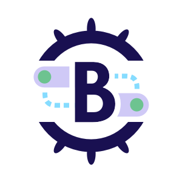

# Brigade: Event-Driven Scripting for Kubernetes

Brigade is a full-featured, event-driven scripting platform built on top of
Kubernetes. It integrates with many different event sources, more are always
being added, and it's easy to create your own if you need something specific.
And the best part -- Kubernetes is well-abstracted so even team members without
extensive Kubernetes experience or without direct access to a cluster can be
productive.

 

> ⚠️ You are viewing docs and code for Brigade 2. If you are looking for legacy
> Brigade 1.x documentation and code, visit
> [the v1 branch](https://github.com/brigadecore/brigade/tree/v1) 

## Getting Started

Ready to get started? Check out our
[QuickStart](https://docs.brigade.sh/intro/quickstart/) for comprehensive
instructions.

## The Brigade Ecosystem

Brigade's API makes it easy to create all manner of peripherals-- tooling, event
gateways, and more.

### Gateways

Our event gateways receive events from upstream systems (the "outside world")
and convert them to Brigade events that are emitted into Brigade's event bus.

* [ACR (Azure Container Registry) Gateway](https://github.com/brigadecore/brigade-acr-gateway)
* [Bitbucket Gateway](https://github.com/brigadecore/brigade-bitbucket-gateway/tree/v2)
* [CloudEvents Gateway](https://github.com/brigadecore/brigade-cloudevents-gateway)
* [Docker Hub Gateway](https://github.com/brigadecore/brigade-dockerhub-gateway)
* [GitHub Gateway](https://github.com/brigadecore/brigade-github-gateway)
* [Slack Gateway](https://github.com/brigadecore/brigade-slack-gateway)

### Other Event Sources

* [Cron Event Source](https://github.com/brigadecore/brigade-cron-event-source)
* [Brigade Noisy Neighbor](https://github.com/brigadecore/brigade-noisy-neighbor)

### Monitoring

[Brigade Metrics](https://github.com/brigadecore/brigade-metrics) is a great way
to obtain operational insights into a Brigade installation.

### SDKs

Use any of these to develop your own integrations!

* [Brigade SDK for Go](https://github.com/brigadecore/brigade/tree/main/sdk) (used by Brigade itself)
* [Brigade SDK for JavaScript](https://github.com/krancour/brigade-sdk-for-js) (and TypeScript)

## Contributing

The Brigade project accepts contributions via GitHub pull requests. The
[Contributing](CONTRIBUTING.md) document outlines the process to help get your
contribution accepted.

## Support & Feedback

We have a slack channel!
[Kubernetes/#brigade](https://kubernetes.slack.com/messages/C87MF1RFD) Feel free
to join for any support questions or feedback, we are happy to help. To report
an issue or to request a feature open an issue
[here](https://github.com/brigadecore/brigade/issues)

## Code of Conduct

Participation in the Brigade project is governed by the
[CNCF Code of Conduct](https://github.com/cncf/foundation/blob/master/code-of-conduct.md).
