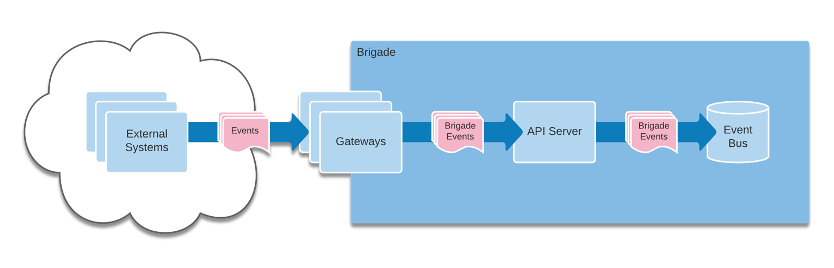
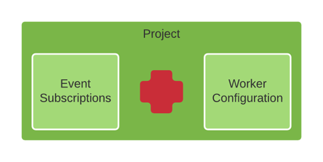
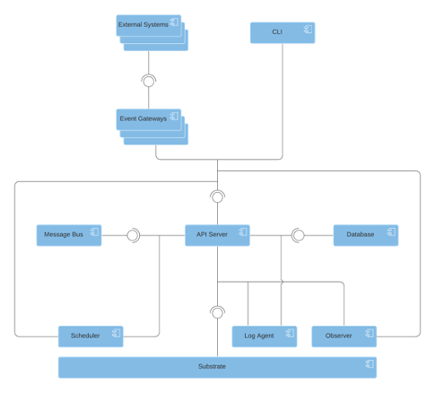

This document describes the function of each of Brigade's major components and
how they integrate with one another to provide an event-driven scripting
platform. It also provides some historical context for how maintainers arrived
at the current architecture.

## Terminology

It is useful to begin with an implementation-neutral description of Brigade's
most important concepts. This is a non-exhaustive introduction to topics that
are covered more thoroughly elsewhere in the documentation.

### Events

__Events__ originate in external systems and arrive in Brigade's
[event bus](#the-event-bus) via [gateways](#event-gateways) and the
[Brigade API](#the-api-server).

  

### Projects

__Projects__ are user-defined. They pair event subscriptions with configuration
and scripts that will handle those events.

  

### The Lifecycle of an Event

When a new [event](#events) arrives at the Brigade
[API server](#the-api-server), a discrete copy of of it is enqueued on the
[event bus](#the-event-bus) for each subscribed [project](#projects).

As capacity permits, a [worker](#workers) described by project configuration is
launched to handle each event by executing script.

## High Level Architecture

The following depicts the major components of Brigade:

  

The following sections describe each of these components in greater detail. They
are presented in an order that is intended accelerate understanding of the
high-level architecture for project newcomers.

### The Workload Execution Substrate

Brigade's tagline has long been "event-driven scripting for Kubernetes,"
but since v2, Kubernetes is effectively an implementation detail.

With an exception for advanced use cases wherein a Brigade script may modify the
Kubernetes cluster in which it executes, and therefore may require some
cluster-specific setup, end-users of Brigade do not interact directly with
Kubernetes. Instead, users interact with Brigade using Brigade's own API. (This
is usually indirectly, via the CLI or other tooling.)

The [API server](#the-api-server) treats Kubernetes as one of several back-end
components. Specifically, it utilizes Kubernetes as a "workload execution
substrate." In other words, it is used to host containerized environments in
which to execute users' scripts.

While project maintainers have no immediate plans to support alternative
substrates, it is nevertheless worth noting that Brigade was explicitly designed
in a manner that retains the possibility of doing so.

### The API Server

All of Brigade's most important functions are abstracted by a RESTful API.
The __API server__ implements and serves that API.

Other Brigade components' interactions with back-end systems such as the
[database](#the-database) or [substrate](#the-workload-execution-substrate) are
generally abstracted by the API. Most components, therefore, depend on the API
server.

It is fair to regard the API server as Brigade's "brain."

### The Database

The [API server](#the-api-server) utilizes [MongoDB](https://www.mongodb.com/)
for all record keeping. This includes, but is not limited to, storing
user-defined projects, events, and even logs produced by users' scripts.

### The Event Bus

The [API Server](#the-api-server) utilizes
[Apache ActiveMQ Artemis](https://activemq.apache.org/components/artemis/),
which implements AMQP 1.0 (Advanced Message Queueing Protocol), as its internal
event bus. A queue per Brigade project ensures events for a given project are
handled on a FIFO (first in, first out) basis.

### Event Gateways

__Event gateways__ are peripheral components, installed separately from Brigade
itself. Their role is to receive events from external systems, transform them
into _Brigade_ events, and utilize the Brigade API to enqueue them in Brigade's
[event bus](#the-event-bus).

### The Scheduler

The __scheduler__ component listens to each project's queue on the
[event bus](#the-event-bus) and also uses the API to monitor capacity on the
[substrate](#the-workload-execution-substrate). The scheduler allocates
available capacity by making API calls to launch [workers](#workers) to handle
each event.

When the demand for substrate capacity outpaces supply, the scheduler
pseudo-randomly allocates newfound capacity. This incorporates a degree of
"fairness" into Brigade's scheduling and prevents projects with high event
volume from monopolizing substrate capacity.

Note that the scheduler function cannot be scaled horizontally. Decoupling this
function from the API server and implementing it as its own microservice ensures
that deployments of Brigade can constrain themselves to a single instance of the
scheduler component whilst still permitting the API server to scale
horizontally.

### The Observer

The role of the __observer__ component is to directly monitor workloads on the
[substrate](#the-workload-execution-substrate) and report their status via the
API.

When a workload is observed to be complete, the observer is also responsible for
evicting the workload from the substrate after a short grace period. This is not
done directly, but again, via an API call. The purpose of the grace period is to
improve the likelihood that log agents capture _all_ logs produced by users'
scripts _before_ the [workers](#workers) that execute them are deleted forever.

As with the [scheduler](#the-scheduler), the observer function cannot be scaled
horizontally. Decoupling this function from the API server and implementing it
as its own microservice ensures that deployments of Brigade can constrain
themselves to a single instance of the observer component whilst still
permitting the API server to scale horizontally.

### Workers

A __worker__ is a containerized script execution environment that is launched
on the [substrate](#the-workload-execution-substrate) to handle an event.
Because that underlying substrate is Kubernetes, a worker is implemented as a
[Kubernetes pod](https://kubernetes.io/docs/concepts/workloads/pods/).

The default worker Docker image can execute scripts written in
[JavaScript](https://en.wikipedia.org/wiki/JavaScript) or
[TypeScript](https://www.typescriptlang.org/) using
[Node.js](https://nodejs.org/). It can also resolve any of a script's
dependencies using either
[npm](https://nodejs.org/en/knowledge/getting-started/npm/what-is-npm/) or
[yarn](https://yarnpkg.com/).

It is also possible, through project configuration, to use workers based on an
alternative Docker image. Such images could provide support for handlers that
are defined using alternative scripting languages or even a declarative syntax.

### Log Agents

Brigade utilizes an instance of [Fluentd](https://www.fluentd.org/) per
Kubernetes node to scrape logs from [worker](#workers) containers and forward
them to the [database](#the-database). This ensures that logs produced by users'
scripts are persisted beyond the short lifetime of the workers that run them.

## History of Brigade

Like its sister project, [Helm](https://helm.sh/), Brigade was born at Deis
prior to the company's eventual acquisition by Microsoft. Both projects were the
product of the same process. Viewing Kubernetes as a sort of "cluster operating
system," the team at Deis sought to identify features of a traditional operating
system that are often taken for granted, but were conspicuously absent from
Kubernetes. Kubernetes lacked a package manager and that directly led to the
inception of Helm to close that gap. Similarly, Kubernetes lacked a scripting
environment -- and that is the gap that Brigade was designed to close.

Brigade reached a stable, 1.0 release in March 2019 and was donated to
[CNCF](https://www.cncf.io/) at that time, becoming a
[sandbox project](https://www.cncf.io/sandbox-projects/). Four minor releases
followed.

By early 2020, Brigade had proven reasonably popular among among
[CNCF survey](https://www.cncf.io/wp-content/uploads/2020/08/CNCF_Survey_Report.pdf)
respondents. Popular though it may have been, maintainers had also accumulated
enough feedback from the community to recognize some course corrections were
required to position the project for greater success. Most insights led back to
a fundamental need to better abstract Brigade users from the underlying
complexities of Kubernetes. A formal proposal for Brigade v2 was drafted by
maintainers and ratified by the community. Over the following two years, Brigade
was re-written from the ground up. As of this writing (early Nov 2021), a GA
release of Brigade v2 is expected in the coming weeks.
