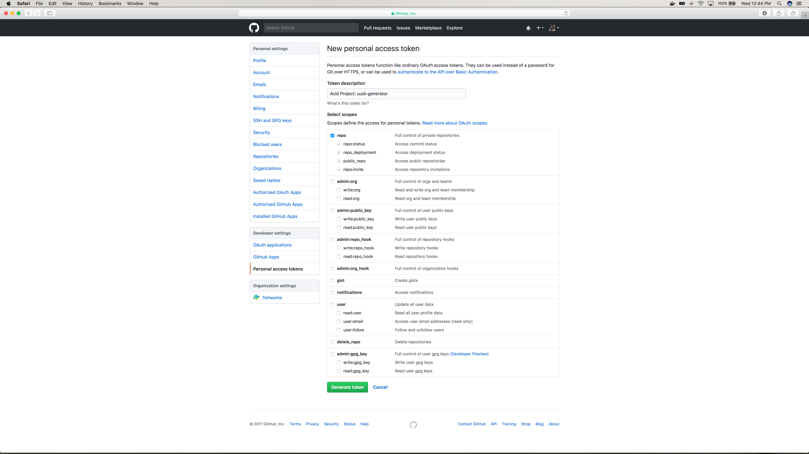
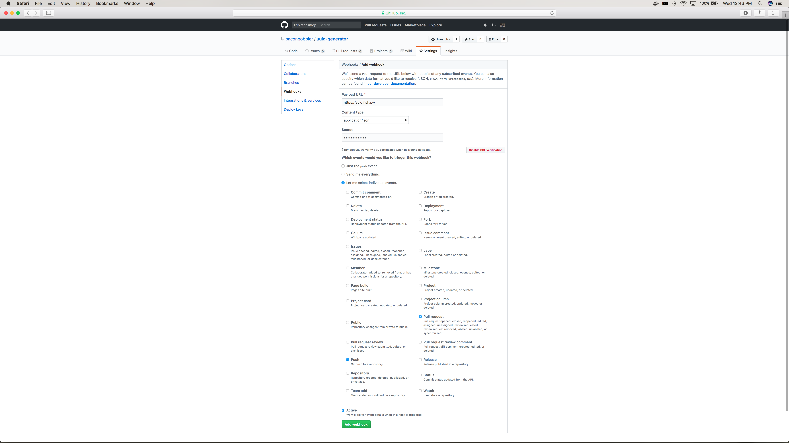

# Writing your first CI pipeline, Part 3

This tutorial begins where [Tutorial 2][part2] left off. We’ll walk through the process for configuring your newly created Github repository with Brigade for testing new features. We'll configure a new Brigade project, and have Github push events to trigger Brigade builds.

## Create a Brigade project

The Brigade server tracks separate configuration for each project you set up. And to create and manage these configurations, we use a simple YAML file and a Helm chart.

First, let's create a new project and point it to the GitHub project we just created, *uuid-generator*

We'll create the simplest config file possible. Substituting *bacongobbler* for your own Github username, open the file `uuid-generator.yaml` and write in the following:

```yaml
project: "bacongobbler/uuid-generator"
repository: "github.com/bacongobbler/uuid-generator"
cloneURL: "https://github.com/bacongobbler/uuid-generator.git"
# Used by GitHub to compute hooks.
# MAKE SURE YOU CHANGE THIS. It's basically a password.
sharedSecret: "MySuperSecret"
# Use this to have Brigade update your project about the build.
# You probably want this if you want pull requests or commits to show
# the build status.
github:
  token: "github oauth token"
```

Make sure to **not** commit this to source control. It contains private data that should not be publicized in a git repository.

To use a Github OAuth token so your Pull Request statuses are updated...

1. Go to https://github.com/settings/tokens/new and enter your password if prompted
2. Give the token a description, such as `brigade project: uuid-generator`
3. Grant the token full *repo* scope so Brigade can update Pull Request statuses



4. Click *Generate token*
5. Copy the personal access token in the next screen and add it to `uuid-generator.yaml`

### Install the project chart

Now that we have written the project chart, let's install this project into Brigade. Recall that in the [Quick install guide](install.md) we used `helm` to install Brigade. We also use it to install projects.

```
$ helm install brigade/brigade-project --name uuid-generator -f uuid-generator.yaml
```

Note that `-n uuid-generator` provides a name for the project, which you will be able to see with `helm ls`. And `-f uuid-generator.yaml` loads the YAML file you wrote above.

Your project configuration can now be managed by Helm. Use `helm upgrade` to change the configuration. And `helm delete` will remove the project. See `man helm-upgrade` for more options and information regarding these commands.

## Configuring Github

We want to build our project each time a new commit is pushed to master, and each time we get a new Pull Request.

To do this, log into your project (substituting *bacongobbler* for your own Github username) on https://github.com/bacongobbler/uuid-generator/settings/hooks.

From your project...

1. On the Webhooks screen, click `Add Webhook`
2. Complete the form:
  - Payload URL should be the URL to your BRIGADE server, adding the github webhook endpoint (e.g. https://brigade.example.com/events/github)
  - Content-Type should be `application/json`
  - Secret should be your secret in the YAML file (`MySuperSecret`)
  - In the radio buttons, choose `Let me select individual events`
    - Select `push` and `pull request`
  - Make sure the `Active` checkbox is selected
  - Click the `Add Webhook` button



To get the IP for your "Payload URL", run this command on your Kubernetes cluster,
and look for the `brigade-github-gw` line:

```console
$ kubectl get service
NAME                        TYPE           CLUSTER-IP   EXTERNAL-IP   PORT(S)          AGE
brigade-brigade-api         ClusterIP      10.0.0.57    <none>        7745/TCP         8h
brigade-brigade-github-gw   LoadBalancer   10.0.0.157   10.21.77.9    7744:31946/TCP   8h
```

You will use the `EXTERNAL-IP` address (feel free to map it to a DNS name if you wish):
`http://10.21.77.9:7744/events/github`

The next time you push to the repository, the webhook system should trigger a build.

> For more on configuring GitHub, see [the GitHub Guide](../topics/github.md)

After configuring Brigade to test new features, read [part 4 of this tutorial][part4] to write a new feature to the uuid-generator project, which will trigger a test build using Brigade.

---

Prev: [Part 2][part2] `|` Next: [Part 4][part4]

[part2]: tutorial02.md
[part4]: tutorial04.md