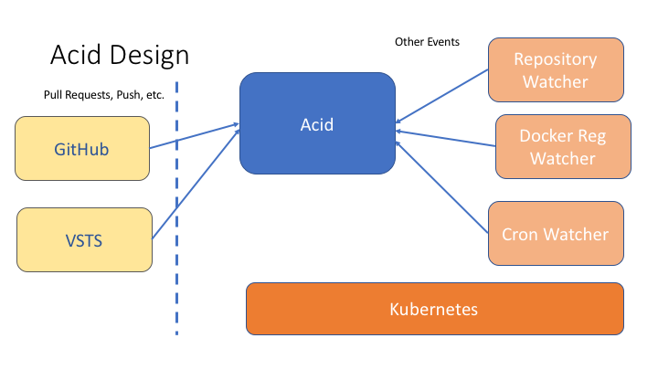

# Acid Design

This is a high-level explanation of the design of Acid.

Acid is an in-cluster runtime environment. It is the basis for systems like CI or CD as well as systems that need in-cluster event handling.

It is designed to:

- run on top of Kubernetes
- be complimentary to Helm
- open an avenue for advanced Kubernetes workflows
  - continuous integration
  - continuous delivery


## Terminology

- **Acid** is the main server. It is designed to run in-cluster as a deployment.
- **AcidIC**: Acid _integration container_ is a container for running a job.
- **Acid.js**: A JavaScript file that contains an Acid configuration. Pronounced
  "Acid Jay Es" or "Acid Jazz".
- **Job**: A build unit, comprised of one or more build steps called "tasks"
- **Webhook**: An incoming request from an external SCM that provides a JSON
  payload indicating that a new contribution has been made. This triggers an
  Acid run.
- **Project**: A named collection of data that Acid operates on, e.g. a GitHub
  repository with source code in it.

## Components

Acid is composed of the following pieces:

- The Acid server
- AcidIC images (acid-ubuntu, acid-go,...)
- The Acid.js supporting libraries (runner.js, quokka)
- The Acid Helm chart (installs Acid into Kubernetes)
- The Acid Project Helm Chart (add or manage a project in an Acid server)

The Acid server is the main server that exposes webhook and other web APIs and triggers script runs.

Acid scripts (acid.js + supporting) run cluster-wide scripts. Just as the constituent parts of a shell script are the UNIX commands, the constituent parts of an Acid script are containers (running in pods). And AcidIC image is just a docker container image that understands how to interoperate with specific Acid components. However, regular container images work just fine.

Acid is installed using a Helm chart. Acid projects, which hold configuration data for Acid, are also installed as charts (though they are just configmaps).

## High-Level Flow

At a high level, Acid can handle different sorts of requests. To provide a simple example, here is a GitHub workflow:


GitHub hosts a number of projects. Our team has configured two Acid projects (`github.com/technosophos/example` and `github.com/helm/otherexample`). Likewise, GitHub has been configured to trigger an Acid build, via webhook, whenever a pull request is received.

1. Event: Github sends a webhook to Acid. Acid authenticates the request.
2. Load Config: Acid loads the configuration for the given GitHub repository. This configuration
   may include credentials, special configuration directives, and settings or properties for the
   build.
3. Run: Acid fetches the github repository, reads the `acid.js` file, and then executes it. In the
  typical build scenario, this script will invoke one or more jobs (Kubernetes pods) that will build
  and test the code.
4. Notify: When the build is complete, Acid will notify GitHub over the GitHub status API. It will
  send GitHub the state (success, failure, etc) along with a link where the user can fetch the logs

The workflow above can be expressed as a series of events.
When a GitHub project is configured to send webhooks to Acid, it will send one
hook request per `push` event.


A hook kicks of an Acid build, which in turn will invoke the repository's `acid.js` file. The build is done inside of Kubernetes, with each `Job` being run as a Kubernetes pod.

Finally, the above can be generalized to a broader pattern. Along with doing GitHub CI operations, Acid can be configured to react to other events.



The above shows other examples of event emitters that Acid could listen for:

- VS Teams: Much the same as Github. And services such as BitBucket could be supported as well.
- Repository Watcher: Watch a Helm chart repository for a change in the chart version, and notify Acid.
  A given `acid.js` may then react by doing a rolling deployment, a stage deployment, etc.
- Docker Registry Watcher: Trigger an Acid event when a docker image version changes.
- Cron Watcher: Trigger an Acid event periodically.

In all cases, the watchers _trigger events_, and Acid determines what to do based on the `acid.js` configuration. To that end, it may be useful to think of Acid as an event watching system or an implementation of a observer pattern.

## Details: The Servers

Acid has three in-cluster components:

- `acid-gateway` listens to external events (GitHub webhooks, DockerHub webhooks, etc) and converts them to Kubernetes resources.
- `acid-controller` is a Kubernetes Controller that watches for certain resources, and starts new builds
- `acid-worker` runs one (and only one) build. Controllers start new workers, which live for the duration of the build.

This section describes how the servers responds to a GitHub pull request or push operation.


When a Webhook `push` event is triggered, the Acid gateway will do the following:

- Load the data provided by the webhook
- Load the project configuration.
  - A configuration has the following:
    - A project name
    - The GitHub URL
    - A GitHub shared secret used for authenticating a webhook request
    - (Optional) An SSH key that Acid can use to securely fetch code from a private GitHub repo
    - (Optional) An OAuth2 token that Acid can use to send upstream status messages to GitHub
  - If a request comes in for a project that does not match any of the configurations,
    Acid returns an error.
- Perform auth against the original payload
  - AuthN is done using GitHub's hook auth mechanism -- a cryptographic hash with
    an agreed-upon secret salt.
  - If auth fails, Acid returns an error
- Clone the GitHub repo (or update if the repo is cached)
  - By default, clone over HTTPS
  - Private repos clone over SSH with an SSH key
- Find and load the acid.js file
  - acid.js must be at the repository root
  - if no file is found, Acid returns an error
- Generate a build ID
- Store the information in a new Secret

At this point, the Acid controller will observe the new secret, and it will:

- Load the secret
- Perform some consistency checks
- Start a new Acid worker

The new Acid worker is responsible for executing the acid.js file:

- Prepare the JavaScript runtime (sandboxed; one per request; never re-used)
- Run the acid.js file
  - For each Acid `Job`, create a config map and a pod.
  - The config map stores instructions on what to execute.
  - The pod mounts the config map as a volume
  - Run until the script is complete. Most jobs are blocking, but jobs can be
    run in the background.
- Update the GitHub status for the commit or pull request
  - On error, report a failure and provide a URL for more info
  - On success, report success

This is the basic operation of Acid for GitHub webhooks.

It's important to note that new webhook types can be added simply by creating a new
gateway for your particular webhook mechanism. While many of the services Acid works
with provide webhook APIs, there is no reason why one could not, for example,
implement a gateway that accepted email messages or chat messages and sent a new
request to the controller.

### Project Configuration

In Acid, each _project_ has a Kubernetes Secret that stores information about that project. An _acid project_ corresponds roughly with the more common notion of a project in software development: a buildable unit of code (usually tracked in an SCM)

The outline of how this project is linked to GitHub is explained above. But that same project could be hooked up to other services. For example, to replicate the older idea of a "nightly build," an in-cluster cron service might trigger a build on a project.

_ALTERNATE DESIGN_: We could eliminate the idea of per-project configuration and instead only have a per-server configuration. In this case, credentials would be shared across multiple GitHub projects (as is the case with CircleCI and TravisCI). However, this might make it harder to retain per-project configurations.

## JavaScript and acid.js

Acid has [a full JavaScript engine](javascript.md) inside. This engine provides some supporting libraries to provide primitives for:

- Creating and managing jobs
- Accessing configuration
- Querying Kubernetes
- Performing basic concurrency tasks

It does _not_ allow loading of external JS via NPM or other JavaScript loaders.

The traditional Acid.js JavaScript implements one or more _event handlers_.

```javascript
// This handles a Push webhook.
events.on("push",  function(acidEvent, project) {
  // Do some stuff
}
events.on("pull_request", function (e, p) {
  // Do something else
})
```

When the Acid server receives an event, it will fire the corresponding hook in
the `acid.js` file.
